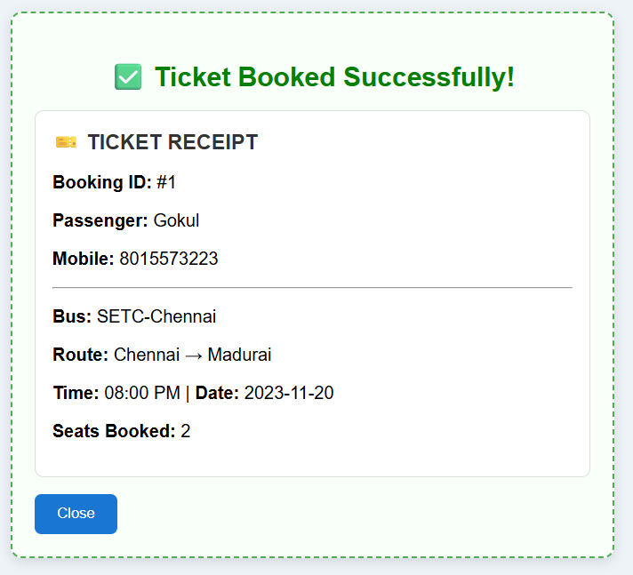
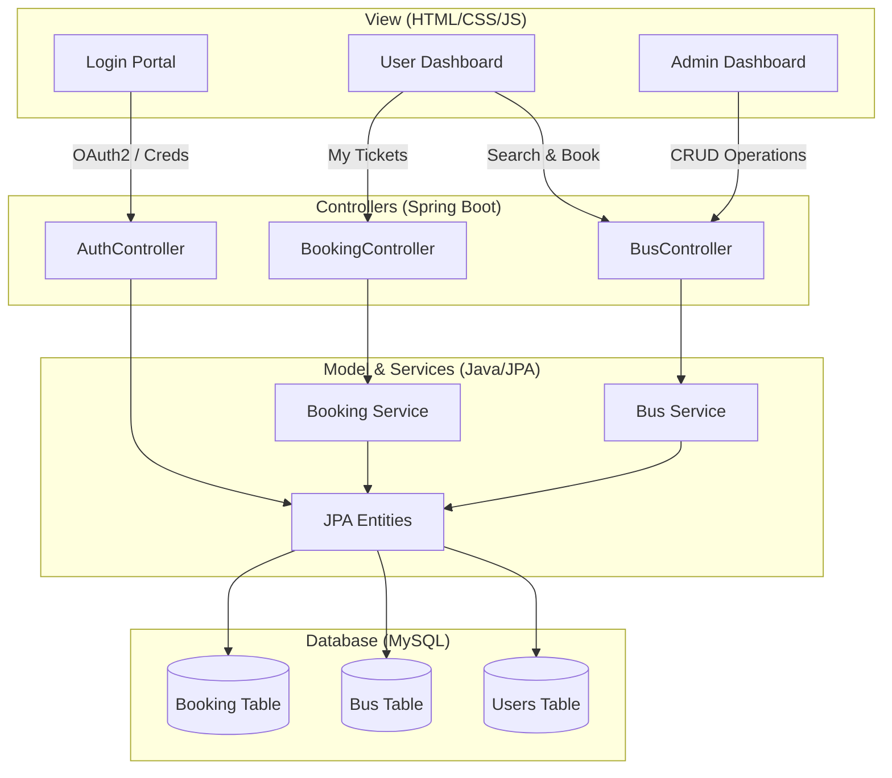

  <h1>Bus Ticket Booking System</h1>
  
<i>A comprehensive, modern web application for managing and booking bus tickets effortlessly.</i>

  <!-- Badges -->
  
  
  
  
  
  

 

## Overview

The **Bus Ticket Booking System** is a full-stack web application designed to bridge the gap between passengers and bus operators. With a clean UI and robust backend architecture, it provides an intuitive booking experience for users and powerful management tools for administrators.

---

## Features at a Glance

### For Users (Passengers)
- **One-Click Login:** Secure authentication using Google OAuth2.
- **Search & Filter:** Find buses seamlessly by entering your `Source` and `Destination`.
- **Instant Booking:** Reserve seats in real-time with comprehensive passenger details.
- **Digital Receipts:** Get an aesthetically pleasing, detailed ticket receipt immediately after booking.
- **My Tickets:** A dedicated dashboard to track all your past and upcoming journeys.

### For Administrators
- **Secure Access:** Dedicated login portal (Demo: `admin` / `pasword123`).
- **Route Management:** Add new buses with complete details: Name, Route, Capacity, **Time**, and **Date**.
- **Live Editing:** Update bus schedules or modify seating capacities dynamically.
- **Fleet Control:** Remove inactive or canceled bus routes from the system instantly.

---

## Visual Showcase

### Login Portal

### User Dashboard

### Ticket Receipt

### My Tickets

### Admin Dashboard

### Admin Operations

---

## Architecture

This project strictly adheres to the **Model-View-Controller (MVC)** design pattern. 

---

## Database Schema

The core of the system is structured around three robust database tables to ensure data integrity and permanent record keeping.

### `users` Table
Manages authentication and user roles.

| Column | Type | Description |
| :--- | :--- | :--- |
| `id` | Integer | Primary Key (Auto-incremented) |
| `email` | String | Unique user email (Google or Admin) |
| `password` | String | Secured access password |
| `role` | Enum | Access level (`ADMIN` or `USER`) |
| `token` | String | JWT session token |

### `bus` Table
Contains the active fleet and scheduling data.

| Column | Type | Description |
| :--- | :--- | :--- |
| `id` | Integer | Primary Key (Auto-incremented) |
| `bus_name` | String | Travels/Operator Name |
| `source` | String | Starting location |
| `destination` | String | Arrival location |
| `seats` | Integer | Available seating capacity |
| `departure_time` | String | Scheduled time (e.g., 08:00 PM) |
| `departure_date` | String | Scheduled date (e.g., 2023-11-20) |

### `booking` Table
A permanent ledger of all tickets generated.

> [!NOTE]
> The booking table stores **snapshots** of the bus data (like time, date, and route). This ensures that even if an administrator deletes a bus from the active schedule, the user's ticket receipt remains completely intact.

| Column | Type | Description |
| :--- | :--- | :--- |
| `id` | Integer | Primary Key (Booking/Ticket ID) |
| `user_id` | Integer | Foreign Key to the `users` table |
| `bus_name` | String | Snapshot of the Operator Name |
| `source` | String | Snapshot of the Origin |
| `destination`| String | Snapshot of the Destination |
| `departure_time`| String | Snapshot of Departure Time |
| `departure_date`| String | Snapshot of Departure Date |
| `passenger_name`| String | Name of the travelling passenger |
| `mobile_number` | String | Passenger's contact number |
| `seats_booked`| Integer | Total seats reserved |

---

